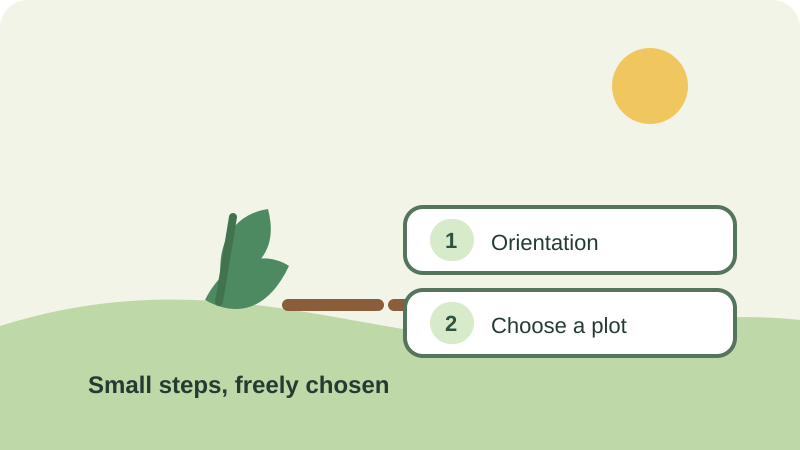

# Commitment and Consistency

## What is it?

Commitment and consistency describes the tendency for people to prefer actions
that fit with choices, statements, or commitments they have already made.
Small, voluntary commitments can sometimes make a related next step feel more
natural, but they do not guarantee that someone will follow through.

## How do you recognize or use it?

It appears when a person is invited to take a small first step before a larger,
related one. Keep each step optional, make the next request clear, and let
people change their minds. Do not hide a larger obligation behind an apparently
minor commitment or treat earlier agreement as permission for unrelated use.

## Examples

- **Application example:** A community garden can invite residents to sign up
  for a free orientation before asking whether they want to reserve a plot.
  Attending signals interest, but the reservation should remain a separate,
  clearly described choice.
- **Image credit:** Original illustration created for this page.

## Sources

- Freedman, Jonathan L., and Scott C. Fraser. “[Compliance Without Pressure:
  The Foot-in-the-Door Technique](https://doi.org/10.1037/h0023552).”
  *Journal of Personality and Social Psychology*, vol. 4, no. 2, 1966,
  pp. 195–202.
- Cialdini, Robert B. “[Harnessing the Science of Persuasion](https://hbr.org/2001/10/harnessing-the-science-of-persuasion).”
  *Harvard Business Review*, 2001.