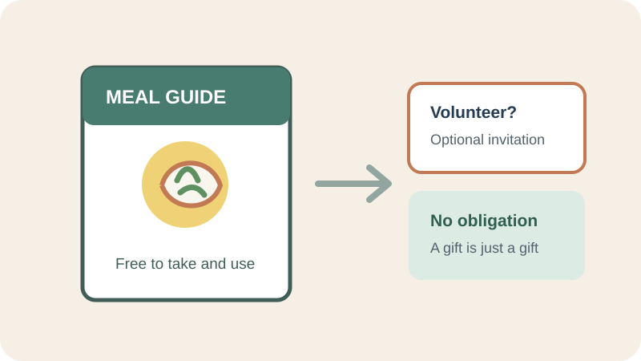

# Reciprocity

## What is it?

Reciprocity is the social expectation that a person who receives a favor,
resource, or kindness may feel inclined to return something in response. The
response can be influenced by context and does not mean the recipient owes a
particular action.

## How do you recognize or use it?

It can appear when a useful sample, guide, or service is offered before a
request. Apply it ethically by making the offer genuinely useful, explaining
any conditions, and keeping acceptance separate from later decisions. Do not
use gifts to imply a debt, conceal a sales pitch, or make refusal difficult.

## Examples

- **Application example:** A local food pantry can offer a free meal-planning
  guide to visitors and separately invite them to volunteer if they wish. The
  guide provides value on its own; receiving it does not obligate anyone to
  volunteer or donate.
- **Image credit:** Original illustration created for this page.

## Sources

- Regan, Dennis T. “[Effects of a Favor and Liking on Compliance](https://doi.org/10.1037/h0030926).”
  *Journal of Experimental Social Psychology*, vol. 7, no. 6, 1971,
  pp. 627–639.
- Cialdini, Robert B. “[Harnessing the Science of Persuasion](https://hbr.org/2001/10/harnessing-the-science-of-persuasion).”
  *Harvard Business Review*, 2001.