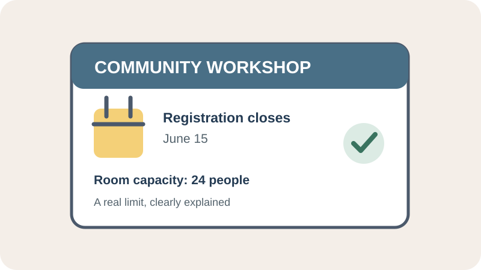

# Scarcity

## What is it?

Scarcity is the influence created when something is perceived as limited in
availability, time, or access. Limited supply can affect how desirable an
option seems, but scarcity alone does not establish that an option is valuable
or right for a particular person.

## How do you recognize or use it?

Watch for claims such as a real enrollment deadline, limited event capacity, or
finite inventory. State the actual limit and its reason, and update the claim
when circumstances change. Avoid fake countdowns, false low-stock notices, or
pressure that prevents people from considering important terms.

## Examples

- **Application example:** A community workshop page can say that registration
  closes on a specific date because the room has a fixed number of seats. The
  page should disclose the date and capacity accurately, rather than showing a
  resetting countdown.
- **Image credit:** Original illustration created for this page.

## Sources

- Worchel, Stephen, Jerry Lee, and Akanbi Adewole. “[Effects of Supply and
  Demand on Ratings of Object](https://doi.org/10.1016/S0022-1031(75)80005-6).”
  *Journal of Personality and Social Psychology*, vol. 32, no. 5, 1975,
  pp. 906–914.
- Cialdini, Robert B. “[Harnessing the Science of Persuasion](https://hbr.org/2001/10/harnessing-the-science-of-persuasion).”
  *Harvard Business Review*, 2001.