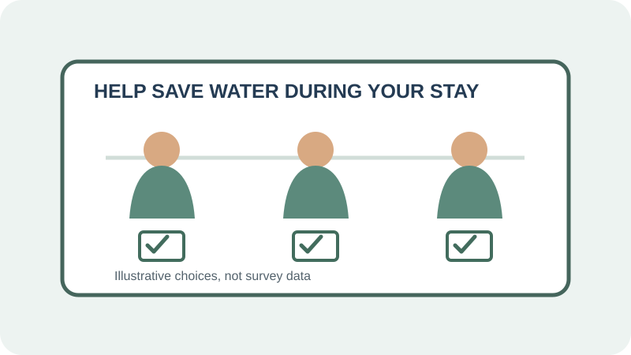

# Social Proof

## What is it?

Social proof is the use of other people's behavior or choices as a cue for
deciding what to do, especially when a situation is uncertain. Examples include
accurately reported participation, community norms, and reviews from real
customers.

## How do you recognize or use it?

Look for claims about what other people do, prefer, or recommend. Use current,
verifiable information and explain who is represented and how the information
was collected. Do not fabricate reviews, present a small or unrepresentative
group as everyone, or imply a majority where one has not been measured.

## Examples

- **Application example:** A hotel can invite guests to reuse towels by
  explaining that reuse is the common practice among guests, but only if it
  has reliable evidence for that claim. A clear opt-in instruction lets guests
  make their own choice.
- **Image credit:** Original illustration created for this page.

## Sources

- Goldstein, Noah J., Robert B. Cialdini, and Vladas Griskevicius. “[A Room
  with a Viewpoint: Using Social Norms to Motivate Environmental
  Conservation in Hotels](https://doi.org/10.1086/586910).” *Journal of
  Consumer Research*, vol. 35, no. 3, 2008, pp. 472–482.
- Cialdini, Robert B. “[Harnessing the Science of Persuasion](https://hbr.org/2001/10/harnessing-the-science-of-persuasion).”
  *Harvard Business Review*, 2001.